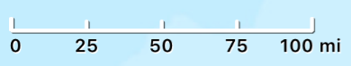
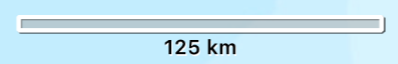
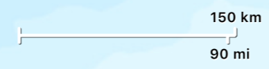

# Scalebar

A scalebar displays the representation of an accurate linear measurement on the map. It provides a visual indication through which users can determine the size of features or the distance between features on a map. A scale bar is a line or bar divided into parts. It is labeled with its ground length, usually in multiples of map units, such as tens of kilometers or hundreds of miles. 

The scalebar uses geodetic calculations to provide accurate measurements for maps of any spatial reference. The measurement is accurate for the center of the map extent being displayed. This means at smaller scales (zoomed way out) you might find it somewhat inaccurate at the extremes of the visible extent. As the map is panned and zoomed, the scalebar automatically grows and shrinks and updates its measurement based on the new map extent.

### Usage

```swift
        let scalebar = Scalebar(mapView: mapView)
        scalebar.style = .alternatingBar
        scalebar.units = .metric
        scalebar.alignment = .left
        view.addSubview(scalebar)
```

To see it in action, try out the [Examples](../../Examples) and refer to [ScalebarExample.swift](../../Examples/ArcGISToolkitExamples/ScalebarExample.swift) in the project.


### Styles

| Style                 | Example                                       |
|-------------          |--------                                       |
|`line`                 |                       |
|`graduated line`       |   |
|`bar`                  |	                        |
|`alternatingBar`       | |
|`dualUnitLine`         |   |


### Units

Two options are available - `metric` and `imperial`. Defaults to the option most appropriate for the device locale. `metric` displays distances in meters and kilometers depending on the map scale, and `imperial` displays distances in feet and miles.

### Alignment

As you pan & zoom the map, the scalebar automatically grows and shrinks to update its measurements for the new map extent. The `alignment` property indicates how the scalebar has been placed on the UI and which section of the scalebar should remain fixed. For example, if you place it in the lower-left corner of the UI, set the alignment to `left` which means that it will grow/shrink on the right side.

### Customization

You can customize many visual elements of the scalebar such as - 

* `fillColor`
* `alternateFillColor`
* `lineColor`
* `shadowColor`
* `textColor`
* `textShadowColor`
* `font`

